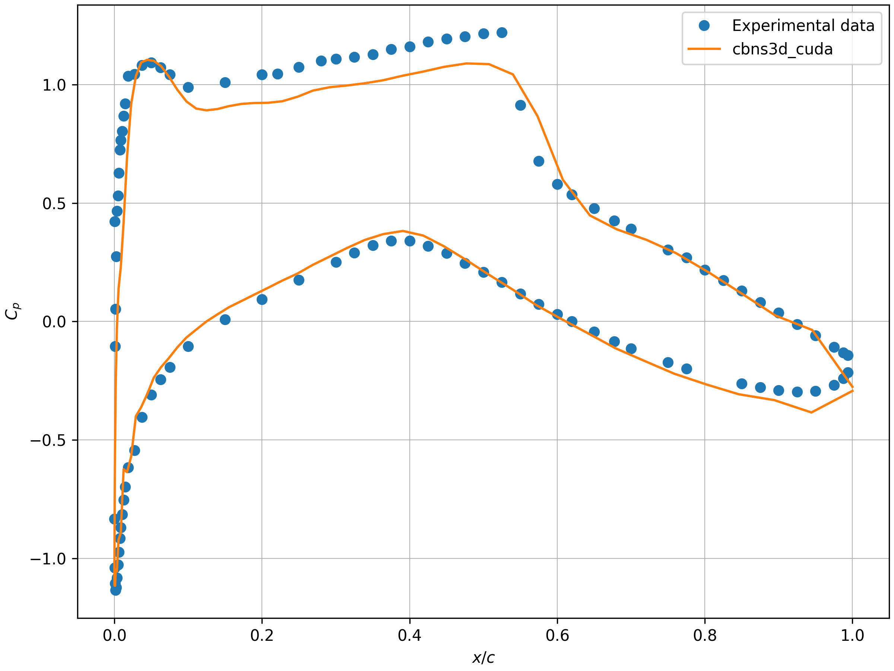

# cbns3d_cuda
This repository provides a **High-Order GPU-Accelerated 3D Compressible Navier-Stokes Solver**. The solver employs high-order finite difference methods to solve the 3D compressible Navier-Stokes equations on curvilinear structured meshes. Developed in C++ with CUDA, it leverages GPU acceleration to significantly enhance computational efficiency. 

This code is derived from my research experience in numerical methods for CFD, and it emphasizes clarity and maintainability, prioritizing transparent algorithmic logic over micro-level code optimization.

<div style="display: flex; align-items: center; justify-content: space-between;">
    
    
</div>

## Features:
- **High-Order Finite Difference Schemes**: Implements a 5th-order WENO scheme for inviscid fluxes and a 4th-order central finite difference scheme for viscous fluxes, ensuring high accuracy in simulations.
- **Curvilinear Structured Mesh Support**: Flexible support for non-Cartesian geometries.
- **CUDA Acceleration**: Leverages GPU computing to significantly enhance computational efficiency.
- **CMake Build System**: Simplified build and cross-platform compatibility.
- **Unit Testing**: Developed with **Google Test** to ensure code reliability.

## Getting Started

### Prerequisites
- **C++14** or higher
- **CMake 3.15** or higher
- **C++ compiler** (e.g., `g++`)
- **CUDA compiler** (e.g., `nvcc`)
- **Python** (for running scripts)

### Clone the Repository
To get started, clone the repository:
```sh
git clone https://github.com/chenbei102/cbns3d_cuda.git
```

### Build the Project
1. **Create a build directory and navigate into it:**
    ```sh
    mkdir build
    cd build
    ```
    
2. **Generate the build files using CMake:**
    ```sh
    cmake -D CMAKE_CUDA_ARCHITECTURES=<value> <path/to/source/code>
    ```
    Replace <value> with the appropriate CUDA architecture for your GPU hardware. This step involves specifying the correct CMAKE_CUDA_ARCHITECTURES value in the configuration to match your GPU's compute capability.

    You can also set optional flags:
    - `-D INVIS_MODE=ON` for an **inviscid** simulation.
    - `-D INVIS_MODE=OFF` for a **viscous** simulation.
    - `-D BUILD_TESTS=ON` to enable building unit tests.

3. **Compile the project:**
    ```sh
    make
    ```

### Run Unit Tests (Optional)
If you enabled unit tests (`BUILD_TESTS=ON`), you can run them with:
```sh
ctest
```

### Run the Solver
1. **Prepare the mesh file:**
    The mesh file should be in the **Plot3D format** for a 3D single-grid.

2. **Edit the .ini configuration file:**
    Edit the `.ini` file to configure the simulation parameters. Refer to the `python/rae2822.ini` file for an example configuration.

3. **Parse the .ini file:**
    Use the `parser_ini.py` script to parse the configuration file:
    ```sh
    python <path/to/source/code>/python/parser_ini.py <ini_file_name>
    ```

4. **Run the solver executable:**
    Execute the solver with the following command:
    ```sh
    ./cbns3d_cuda
    ```

### Visualization and Postprocessing
Once the simulation is complete, the resulting flow field data will be saved in a file named `output.vtk` in **legacy VTK format**. You can visualize and postprocess the data using **ParaView** or other compatible software.
